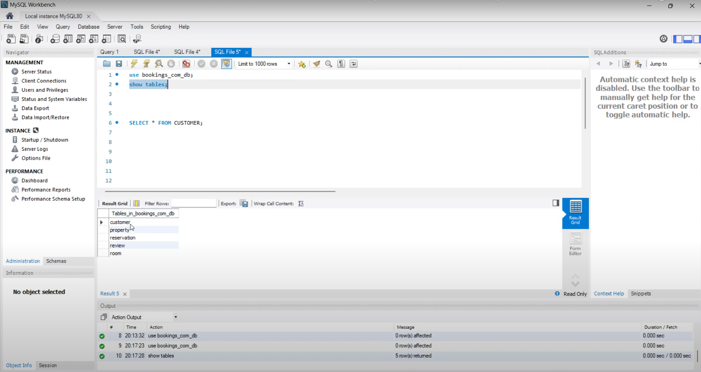
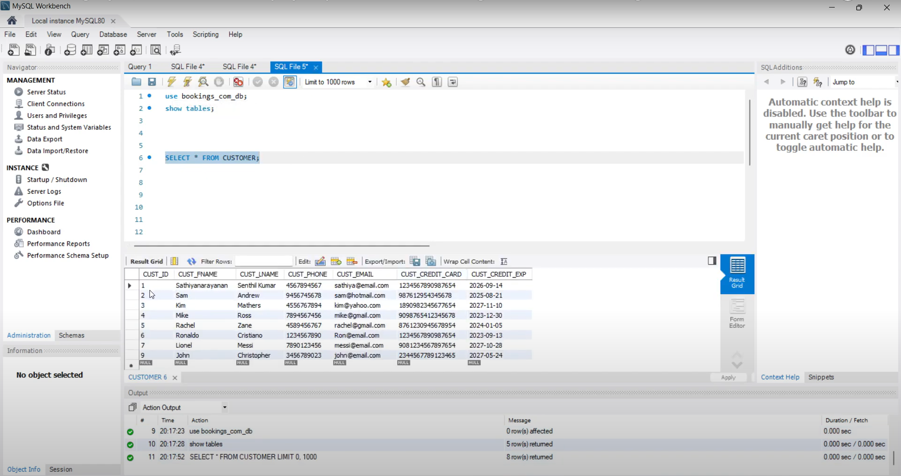
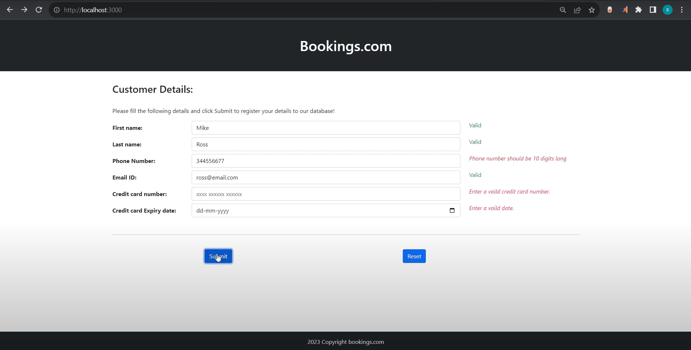
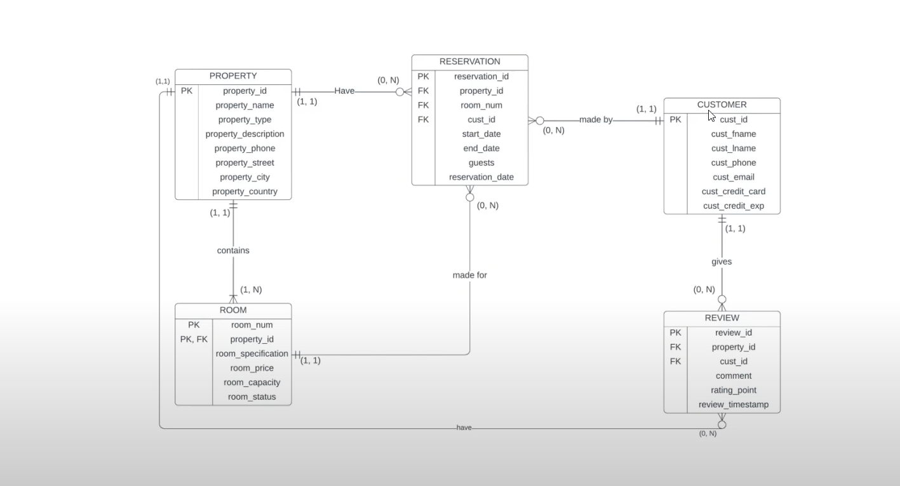

# 🏨 Room Booking Website  (Just completed the customer details part, Still WIP)

Welcome to the **Room Booking Website**, a modern platform for managing room bookings with ease. This project highlights my expertise in full-stack web development and SQL, combining a responsive frontend with a robust backend and database integration.  

---  

## 🌟 About the Website  

This room booking system allows users to browse properties, check room availability, and book their stay. Built with **Node.js**, **Express**, and **MySQL**, it ensures a seamless and efficient booking experience.  

### Key Features:  
- **Room Management**: Browse and manage rooms with details like price, amenities, and availability.  
- **Booking System**: Book rooms with specified dates and guest counts.  
- **Customer Reviews**: Submit and view feedback on properties.  
- **Database Integration**: Securely store customer, property, room, and reservation data.  

---  

## 🛠️ Tech Stack  

This project leverages the following technologies:  
- **Frontend**:  
  - **HTML5** and **Bootstrap** for a responsive and modern UI.  
  - **JavaScript** for interactive form validation and user experience.  
- **Backend**:  
  - **Node.js** with **Express** for handling server-side logic.  
- **Database**:  
  - **MySQL** for relational database management, normalized to 3NF for efficiency.  

---  

## 🎯 Features  

### 🏘️ Property & Room Management  
Easily browse properties and their associated rooms, complete with amenities, prices, and occupancy status.  

### 📅 Booking System  
Select dates, specify the number of guests, and book available rooms.  

### ⭐ Customer Reviews  
Share feedback on properties and view aggregated ratings and comments.  

### 🔍 Dynamic SQL Operations  
Efficient queries and views for seamless database interaction, ensuring quick and accurate data handling.  

---  

## 📸 Screenshots  

Take a glimpse of the website:  

  
  
  
  

---  

## Demo Video

Click below to see how the website works

---

## 🚀 How to Run the Website  

To run this project locally:  
1. Clone the repository to your local machine.
2. Read the all the 3 pdfs in this repositry.  
3. Navigate to the project directory.  
4. Install the required dependencies.  
5. Start the server and open your browser to access the website.  

---  

## 🚧 Future Enhancements  

- Add **user authentication** for personalized booking and review history.  
- Integrate **payment gateways** for online transactions.  
- Implement **real-time availability** updates for rooms.  
- Enhance the **UI/UX** with animations and advanced layouts.  

---  

## 🤝 Acknowledgments  

Special thanks to **Node.js**, **Express**, **Bootstrap**, and **MySQL** for providing the tools and frameworks that made this project possible.  

---  

## 📬 Contact  

Explore, contribute, or connect! For inquiries or feedback, reach out to me at [sathiyanarayanan.s1698@gmail.com](mailto:sathiyanarayanan.s1698@gmail.com).  

---  

Enjoy your stay, and happy booking! 🛎️  
